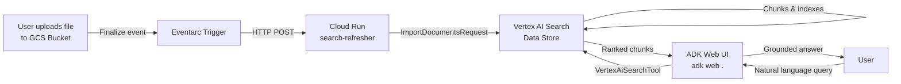

# Doc Scanner — Automated Vertex AI Search Pipeline

An automated document indexing pipeline that triggers real-time ingestion into **Vertex AI Search** whenever a file is uploaded to GCS, queryable via an **ADK-powered AI agent** with a web UI.

---

## Architecture



### Components

| Component | Description |
|---|---|
| **GCS Bucket** | Source of truth for all documents (PDF, DOCX, XLSX, etc.) |
| **Eventarc Trigger** | Listens for `google.cloud.storage.object.v1.finalized` events on the bucket |
| **Cloud Run (`search-refresher`)** | Flask service that receives Eventarc payloads and calls `ImportDocumentsRequest` on the data store |
| **Vertex AI Search Data Store** | Unstructured data store with Layout Parser + chunking enabled |
| **ADK Agent (`DocumentAssistant`)** | Gemini-powered agent with `VertexAiSearchTool` for grounded, cited answers |
| **ADK Web UI** | Built-in browser chat interface served by `adk web` |

---

## Project Structure

```
doc-scanner/
├── main.py                        # Cloud Run ingestion service
├── deploy.sh                      # Full deployment script
├── requirements.txt               # Python dependencies
├── test_main.py                   # Unit tests for ingestion logic
├── agent.py                       # Standalone script version of the agent
└── document_assistant/            # ADK web agent package
    ├── __init__.py
    └── agent.py                   # Defines root_agent for adk web
```

---

## Configuration Parameters

All parameters can be set as environment variables or edited directly in `deploy.sh`.

| Parameter | Default | Description |
|---|---|---|
| `PROJECT_ID` | `aimlexplore` | GCP Project ID where all resources live |
| `BUCKET_NAME` | `santytestdata26` | GCS bucket to monitor for new uploads |
| `DATASTORE_ID` | `test_1774333509084` | Vertex AI Search Data Store ID |
| `COLLECTION_ID` | `default_collection` | Vertex AI Search Collection ID |
| `LOCATION` | `us` | Region for Vertex AI Search (matches bucket location) |
| `REGION` | `us-central1` | Cloud Run deployment region |
| `SERVICE_ACCOUNT` | `394260752043-compute@developer.gserviceaccount.com` | Service account for Eventarc trigger |

---

## Getting Started

### Prerequisites
- Google Cloud SDK (`gcloud`) authenticated
- Python 3.10+ with `venv`
- GitHub CLI (`gh`) — optional, for repo push

### 1. Clone the repo
```bash
git clone https://github.com/santyautomates/doc-scanner.git
cd doc-scanner
```

### 2. Set up Python environment
```bash
python3 -m venv venv
source venv/bin/activate
uv pip install -r requirements.txt   # fast install
# or: pip install -r requirements.txt
```

### 3. Set GCP credentials
```bash
gcloud config set project aimlexplore
gcloud auth application-default login
gcloud auth application-default set-quota-project aimlexplore
```

### 4. Run the ADK Web UI (local)
```bash
adk web .
```
Then open **http://localhost:8000** in your browser, select `DocumentAssistant`, and start chatting.

### 5. Deploy to Google Cloud
```bash
chmod +x deploy.sh
./deploy.sh
```
This deploys Cloud Run and creates the Eventarc trigger. The Cloud Run section is commented out if already deployed — uncomment to redeploy.

---

## Testing

### Run unit tests
```bash
pytest test_main.py -v
```

### Manual end-to-end test
1. Upload any PDF/DOCX/XLSX to `gs://santytestdata26/`
2. Wait ~30 seconds for the Eventarc → Cloud Run → Vertex AI indexing to complete
3. Run `adk web .` and ask a question about the document content

---

## IAM Roles Required

| Service Account | Role |
|---|---|
| `service-{PROJECT_NUMBER}@gcp-sa-eventarc.iam.gserviceaccount.com` | `roles/eventarc.serviceAgent` |
| `service-{PROJECT_NUMBER}@gs-project-accounts.iam.gserviceaccount.com` | `roles/pubsub.publisher` |
| `{PROJECT_NUMBER}-compute@developer.gserviceaccount.com` | `roles/storage.admin`, `roles/eventarc.eventReceiver` |
